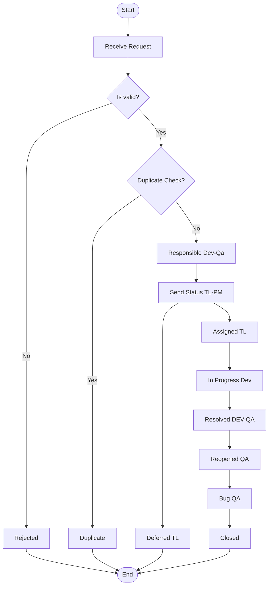
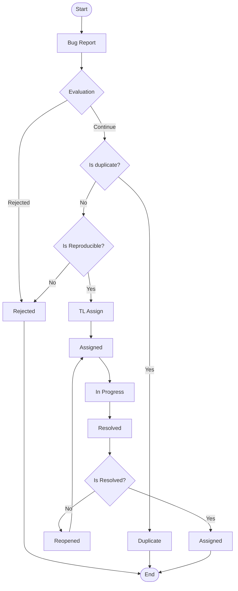

# Diagramas de Flujo - Procesos del Sistema

## Descripción General
Este documento contiene los diagramas de flujo principales del sistema, incluyendo el proceso de validación de transacciones y el flujo de procesamiento de solicitudes. Cada diagrama representa diferentes aspectos del manejo de datos y validaciones en el sistema.

## Diagrama 1: Proceso de Validación de Transacciones

### Diagrama Visual
```
                                    Rejected
                                       ↑
                    ┌─────────────────────────────────┐
                    │                                 │
Start → Receive → Decision1 → Decision2 → Duplicate
        Request   (Is valid?)  (Duplicate   
                      │         Check?)      
                      ↓            │
                   Rejected        ↓
                                   │
                              Responsible
                              (Dev-Qa)
                                   │
                                   ↓
                              Send Status → Assigned → In Progress → Resolved → Reopened → Bug → Closed
                              (TL-PM)      (TL)      (Dev)        (DEV-QA)    (QA)       (QA)
                                   │                                                      ↑
                                   ↓                                                      │
                              Deferred                                              Reopened
                              (TL)                                                   (QA)
```

### Descripción del Flujo Principal

**Proceso de Validación de Transacciones:**

1. **Start (Inicio)**: Punto de entrada del sistema
2. **Receive Request**: Recepción de la solicitud de transacción
3. **Decision1 - Is valid?**: Primera validación de la solicitud
   - Si es inválida → **Rejected**
   - Si es válida → Continúa al siguiente paso
4. **Decision2 - Duplicate Check?**: Verificación de duplicados
   - Si es duplicado → **Duplicate**
   - Si no es duplicado → Continúa al flujo de procesamiento

**Estados del Proceso:**
- **Responsible (Dev-Qa)**: Asignación de responsabilidad
- **Send Status (TL-PM)**: Envío de estado por Team Lead/Project Manager
- **Assigned (TL)**: Asignado por Team Lead
- **In Progress (Dev)**: En desarrollo
- **Resolved (DEV-QA)**: Resuelto por desarrollo y QA
- **Reopened (QA)**: Reabierto por QA si hay issues
- **Bug (QA)**: Identificado como bug por QA
- **Closed**: Proceso completado exitosamente

**Estados de Finalización:**
- **Rejected**: Solicitud rechazada por validación fallida
- **Duplicate**: Solicitud duplicada
- **Deferred (TL)**: Diferido por Team Lead
- **Closed**: Completado exitosamente

---

## Diagrama 2: Flujo de Procesamiento de Solicitudes

### Diagrama Visual
```
Start → Bug Report → Evaluation → Rejected
         (Bug)         │            ↑
                       ↓            │
                   Is duplicate? ───┘
                       │
                       ↓
                   Duplicate
                       │
                       ↓
                   Is Reproducible?
                       │
                       ↓
                   TL Assign → Assigned → In Progress → Resolved → Is Resolved? → Assigned
                       │         │           │           │            │            │
                       ↓         ↓           ↓           ↓            ↓            ↓
                   Rejected   Assigned   In Progress   Resolved   Reopened    Assigned
```

### Descripción del Flujo de Procesamiento

**Proceso de Manejo de Bugs y Solicitudes:**

1. **Start**: Inicio del proceso
2. **Bug Report**: Reporte inicial del bug o solicitud
3. **Evaluation**: Evaluación inicial del reporte
   - Verificación si es duplicado → **Rejected** si es duplicado
   - Si no es duplicado → Continúa
4. **Is duplicate?**: Verificación de duplicados
   - Si es duplicado → **Duplicate**
   - Si no es duplicado → Continúa
5. **Is Reproducible?**: Verificación si el bug es reproducible
   - Si no es reproducible → Puede ser rechazado
   - Si es reproducible → Continúa al proceso de asignación

**Ciclo de Procesamiento:**
- **TL Assign**: Asignación por Team Lead
- **Assigned**: Estado asignado
- **In Progress**: En proceso de desarrollo/corrección
- **Resolved**: Resuelto
- **Is Resolved?**: Verificación de resolución
  - Si no está completamente resuelto → **Reopened**
  - Si está resuelto → **Assigned** para verificación final

**Estados Finales:**
- **Rejected**: Rechazado por no cumplir criterios
- **Duplicate**: Identificado como duplicado
- **Assigned**: Completado y verificado

---

## Código Mermaid para Referencia

### Diagrama 1 - Proceso de Validación
<details>
<summary>Ver código Mermaid del Diagrama 1 (click para expandir)</summary>


</details>

### Diagrama 2 - Flujo de Procesamiento
<details>
<summary>Ver código Mermaid del Diagrama 2 (click para expandir)</summary>


</details>

---

## Análisis Comparativo de los Diagramas

### Similitudes
- Ambos diagramas incluyen validaciones iniciales
- Tienen puntos de decisión para rechazar solicitudes inválidas
- Incluyen verificación de duplicados
- Manejan estados de asignación y procesamiento
- Terminan en estados finales claramente definidos

### Diferencias Clave

**Diagrama 1 (Validación de Transacciones):**
- Enfocado en el flujo técnico de validación
- Incluye roles específicos (Dev-QA, TL-PM)
- Maneja estados de desarrollo (Assigned, In Progress, Resolved)
- Incluye ciclo de reapertura y corrección de bugs

**Diagrama 2 (Procesamiento de Solicitudes):**
- Enfocado en el manejo de reportes de bugs
- Incluye evaluación de reproducibilidad
- Flujo más lineal con menos ramificaciones
- Énfasis en la verificación final de resolución

## Componentes Principales del Sistema

### Roles y Responsabilidades
- **Dev-QA**: Desarrolladores y Quality Assurance
- **TL (Team Lead)**: Líder técnico responsable de asignaciones
- **PM (Project Manager)**: Gestor de proyecto
- **QA**: Quality Assurance para verificaciones finales

### Estados del Sistema
1. **Estados Iniciales**: Start, Receive Request, Bug Report
2. **Estados de Validación**: Evaluation, Is valid?, Is duplicate?, Is Reproducible?
3. **Estados de Procesamiento**: Assigned, In Progress, Resolved
4. **Estados Finales**: Closed, Rejected, Duplicate, Assigned (final)

### Puntos de Control
- **Validación inicial**: Verificación de formato y contenido
- **Control de duplicados**: Prevención de procesamiento redundante
- **Verificación de reproducibilidad**: Asegurar que los bugs son válidos
- **Revisión de resolución**: Confirmar que las correcciones son efectivas

## Flujos de Trabajo Recomendados

### Para Transacciones Nuevas
1. Seguir el Diagrama 1 para validación completa
2. Asegurar que todas las validaciones pasen antes del procesamiento
3. Mantener trazabilidad a través de los estados

### Para Reportes de Bugs
1. Usar el Diagrama 2 para manejo sistemático
2. Verificar reproducibilidad antes de asignar recursos
3. Incluir ciclo de verificación post-resolución

## Métricas y Monitoreo

### KPIs Sugeridos
- **Tasa de rechazo**: Porcentaje de solicitudes rechazadas en validación inicial
- **Tiempo de resolución**: Tiempo promedio desde asignación hasta cierre
- **Tasa de reapertura**: Porcentaje de casos que requieren reapertura
- **Duplicados detectados**: Eficiencia del sistema de detección de duplicados

### Puntos de Medición
- Cada transición entre estados
- Tiempo de permanencia en cada estado
- Razones de rechazo más comunes
- Efectividad de las resoluciones (casos no reabiertos)